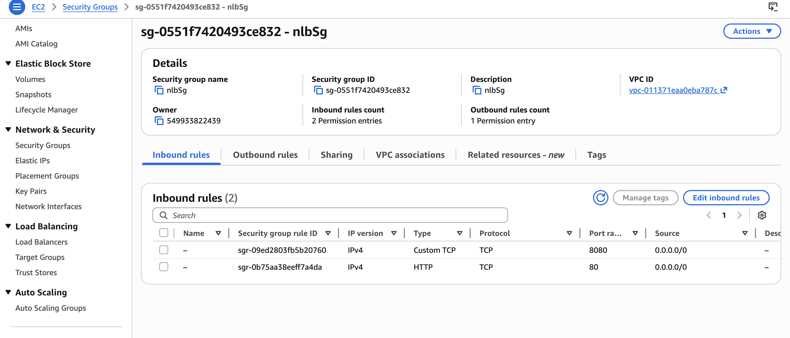
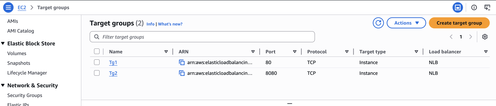
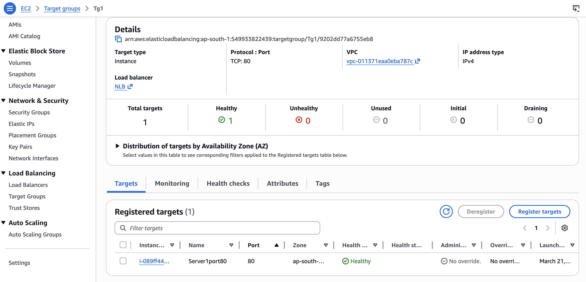
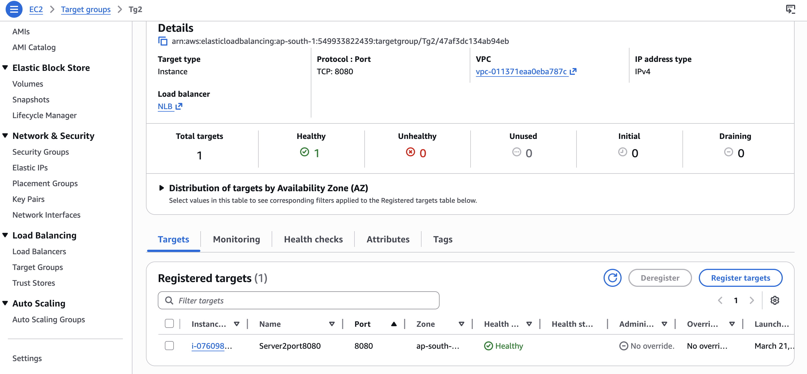
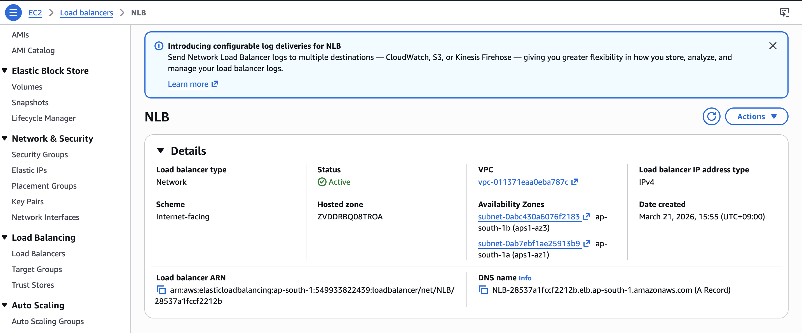
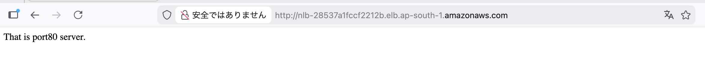

# AWS NLB Multi-Port Routing & Traffic Isolation Lab

**AWS Network Load Balancer (NLB) implementation for high-performance traffic isolation and multi-port service routing.**

**Scenario:** To achieve ultra-low latency and handle high-throughput traffic, I implemented an AWS Network Load Balancer (NLB). This project demonstrates the configuration of an NLB to route traffic to different backend web servers based on specific port numbers (Port 80 and Port 8080).
 
**シナリオ:** 超低遅延と高スループットのトラフィックを実現するために、AWS Network Load Balancer (NLB) を実装しました。 このプロジェクトでは、ポート番号（Port 80 および Port 8080）に基づいてトラフィックを異なるバックエンドWebサーバーにルーティングするように NLB を構成する方法を実証しています。

---

# **Project Architecture / プロジェクト構成図**

This setup utilizes an NLB at the Transport Layer (Layer 4) to distribute traffic across target groups mapped to distinct TCP ports for maximum efficiency.
 
このセットアップでは、トランスポート層（レイヤー 4）で NLB を利用し、効率を最大化するために、特定の TCP ポートにマッピングされたターゲットグループにトラフィックを分散します。

#  **Key Components / 主な構成要素**

* **Network Load Balancer (NLB):** High-performance load balancer providing near-zero latency by processing traffic at the connection level.
  **ネットワークロードバランサー (NLB):** 接続レベルでトラフィックを処理することにより、ほぼゼロの遅延で高パフォーマンスな負荷分散を提供します。

* **Listeners:** Dual-listener configuration on TCP Port 80 and TCP Port 8080 to manage incoming traffic streams.
  **リスナー:** 受信トラフィックを管理するために、TCP ポート 80 および TCP ポート 8080 でデュアルリスナー構成を採用しています。

* **Target Groups:**
    * **TG-1 (Port 80):** Routes public traffic to Server 1.
      **TG-1 (ポート 80):** パブリックトラフィックをサーバー 1 にルーティングします。
    * **TG-2 (Port 8080):** Routes administrative/specialized traffic to Server 2.
      **TG-2 (ポート 8080):** 管理用または特殊なトラフィックをサーバー 2 にルーティングします。

* **EC2 Instances:** Ubuntu instances running **Apache2** with customized port configurations.
  **EC2 インスタンス:** カスタマイズされたポート構成で **Apache2** を実行する Ubuntu インスタンスです。
---

#  **Implementation Steps / 実装手順**

<b>Click here to view Step-by-Step Configuration & Results / ステップごとの設定と結果を表示するにはここをクリック</b>

| Step / ステップ | Description / 説明 | Screenshot / スクリーンショット |
|:---:|---|:---:|
| **1. Security Group** | Configured rules for SSH (22), HTTP (80), and Custom TCP (8080) for cross-port communication. |  |
| **2. Target Group Setup** | Created two TCP target groups (TG-1 and TG-2) to isolate traffic by destination port. |  |
| **3. Health Verification** | Verified that both instances reached a "Healthy" state within their respective target groups. |     |
| **4. NLB DNS Mapping** | Configured the NLB to forward Port 80 to TG-1 and Port 8080 to TG-2 using its unique DNS endpoint. |  |
| **5. Traffic Testing** | Successfully accessed Server 1 via standard DNS and Server 2 by appending `:8080` to the URL. |     |

---

#  **Technical Insights / 技術解説**

* **Ultra-Low Latency:** By operating at Layer 4, the NLB provides significantly faster response times than an Application Load Balancer (ALB) for TCP-based traffic.
* **レイヤー 4 による超低遅延:** レイヤー 4 で動作することにより、NLB は TCP ベースのトラフィックに対して ALB よりも大幅に速い応答時間を提供します。

 

* **Traffic Isolation & Security:** Using multiple ports (80 vs 8080) allows for the logical separation of public services and internal administrative tasks on the same infrastructure.
* **トラフィックの分離とセキュリティ:** 複数のポート（80 対 8080）を使用することで、同じインフラストラクチャ上でパブリックサービスと内部管理タスクを論理的に分離できます。

---

#  **Tech Stack / 使用技術**

* **AWS Services:** Network Load Balancer (NLB), EC2 (Ubuntu), VPC, Target Groups.
* **Web Server:** Apache2.
* **Protocols:** TCP/IP, Port 80, Port 8080.
